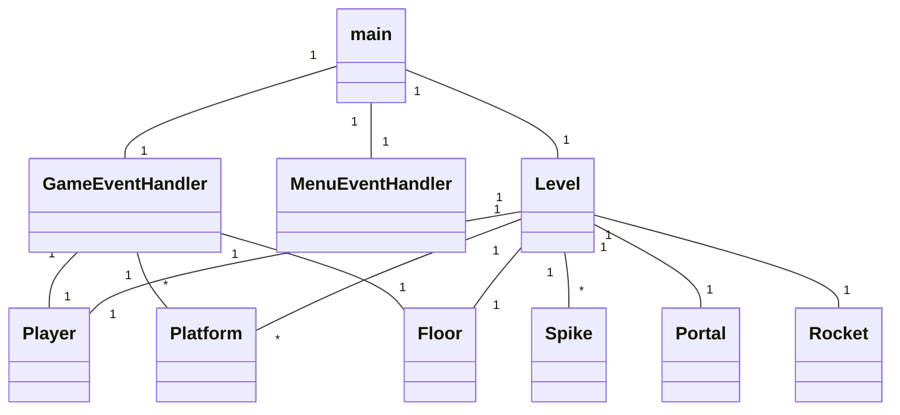
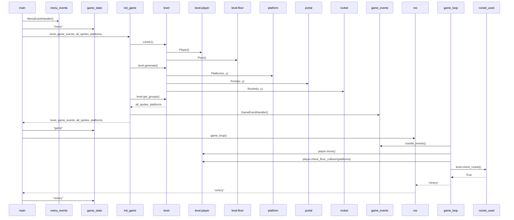

## Luokkakaavio

Sovelluksen tämänhetkinen luokkarakenne. Level-luokka pitää sisällään pelaajan ja kaikki spritet, joiden kanssa pelaaja voi kanssakäydä. Level-luokka tarkistaa törmäämiset esim. portaalien, rakettien ja piikkien kanssa. GameEventHandler ja MenuEventHandler -luokat vastaavat käyttäjän syötteiden valvonnasta ja hallinnasta. 

## Sekvenssikaavio

Pelin käynnistäminen, siirtyminen menusta pelisilmukkaan ja pelin päättyminen luokkakaaviona. 

Pääohjelma alustaa syötteenvalvonnasta vastaavan luokan ja pelin tilan. Kun peli aloitetaan, init_game() metodi luo tarvittavat oliot (Level, GameEventHandler, Player, Platform) ja palauttaa ne. 

Pelin tilan muutos "menu":sta "game":ksi siirtää suorituksen toiseen päähohjelman haaraan ja varsinainen pelisilmukka käynnistyy. Pelisilmukalle välitetään ikkuna ja luodut oliot. 

Game_loop metodissa valvotaan käyttäjän syötteitä GameEventHandler-luokan metodeilla ja likuutetaan pelaajahahmoa sen omalla metodilla. GameEventHandler muuttaa Player-olion luokkamuuttujia joiden perusteella move-metodi liikuttaa pelaajahahmoa. Lisäksi tarkistetaan törmääminen portaaleihin, raketteihin ja piikkeihin. Pääsilmukka tallentaa game_loopin palautukset muuttujaan ja tarkistaa muttujan sisällön, jos sisältö vastaa jotakin haaraehtoa, pääsilmukan haara vaihtuu ja tällöin vaihtuu myös pelin tila. 
