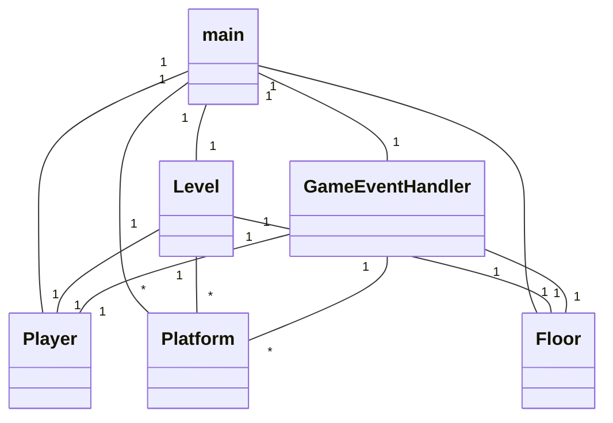

```mermaid
 classDiagram
    main "1" -- "1" Player
    main "1" -- "*" Platform
    main "1" -- "1" Floor
    main "1" -- "1" GameEventHandler
    main "1" -- "1" Level
    Level "1" -- "1" Player
    Level "1" -- "1" Floor
    Level "1" -- "*" Platform
    GameEventHandler "1" -- "1" Player
    GameEventHandler "1" -- "*" Platform
    GameEventHandler "1" -- "1" Floor
    
```
