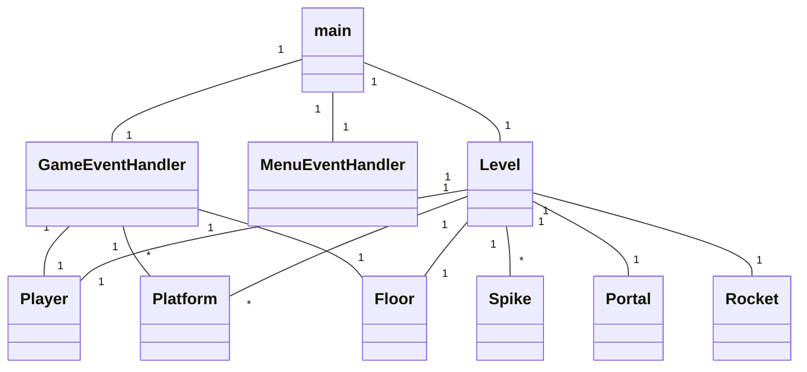
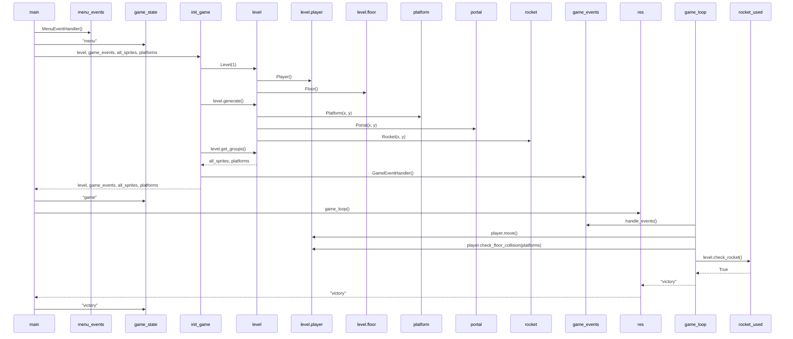

# Arkkitehtuurikuvaus

Projektin hakemistorakenteen ja sovelluslogiikan kuvaus.

## Hakemistorakenne

Projektin lähdekoodi on jaettu useaan moduuliin, jotka on ryhmitelty kansioihin. 

### src/

- **config.py:** Vakiomuuttujat, ikkunan koko, fps, pelaajan kiihtyvyys ja kitka, fontit, tasojen määrä.
- **event_handler.py:** Pelaajan syötteen valvonnasta vastaavat luokat.
- **game.py:** Peli- ja menusilmukat. Alustusfuntkiot.
- **level.py:** Tasojen lataaminen ja generointi. Valvoo pelaajan interaktioita portaalien ja piikkien kanssa.
- **main.py:** Pääohjelma.
- **text_renderer.py:** Tekstin piirtämisestä vastaavat funtkiot.
- **tasks.py:** Invoke-taskit.
  - Käynnistäminen, testien suorittaminen, pylint, autopep8 ja kattavuusraportin generointi.

### src/assets/

- Pelaajahahmo, platformi, lattia, portaali, raketti ja piikkipallo.
- BMP-muodossa.

### src/levels/

- Json-tiedostoja.
- Sisältävät tasokohtaiset koordinaatit platformeille, portaaleille, piikeille ja raketille.

### src/sprites/

- Pelaaja, platformi, portaali, raketti ja piikki -luokat.

### src/tests/

- Projektin yksikkötestit.
- Jaettu tiedostoihin testattavan alueen mukaan.

## Sovelluslogiikka

### Keskeisin toiminnallisuus

Projektin sovelluslogiikka on pyritty erottamaan käyttöliittymäkoodista. Logiikka perustuu lähinnä Level, GameEventHandler ja Player -luokkien yhteistyöhön. GameEventHandler valvoo käyttäjän syötteitä ja kutsuu Player-luokan metodeja niiden mukaan.

Level-luokka valvoo pelaajan siirtymiä portaalien kautta tasolta toiselle ja muodostaa uusia tasoja json-tiedostojen pohjalta. Json-tiedostot ovat vakioita, eivätkä niiden sisältämät arvot muutu pelin aikana.

Player-luokka pitää sisällään pelaajan liikettä ohjaavat metodit. Player suorittaa myös kollisionvalvontaa hyppyjä varten.

### Esimerkkejä toiminnallisuudesta

Pelaajan painaessa "a"-näppäintä GameEventHandler kutsuu pelaajaolion change_direction-metodia argumentilla "left", mikä vaihtaa pelaajaolion moveleft-attribuutin arvon True:ksi. Kun "a"-näppäin päästetään irti, GameEventHandler kutsuu samaa change_direction-metodia argumentilla "cancel_left", mikä muuttaa moveleft-attribuutin takaisin False:ksi.

Pelaajan törmätessä portaaliin Level-luokka tarkistaa nykyisen tason ja aloittaa toimenpiteet, mikäli seuraava taso on olemassa. Jos seuraava taso on olemassa, luokka kutsuu omaa clear_grops- metodia, joka tyhjentää edellisen tason platformit, portaalit ja piikit luokan muistista. Tämän jälkeen kutsutaan generate-metodia, joka pulestaan kutsuu get_level_data-metodia lukeakseen seuraavan tason tiedot json-tiedostosta. Generate-metodi käy läpi sanakirjaa, joka sisältää jokaisen tasolle kuuluvan esineen koordinaatit ja luo vastaavat sprite-oliot. Oliot tallennetaan Level-luokan sprite-ryhmiiin, jotka pelisilmukka lukee ja piirtää näytölle.

## Luokkakaavio

Sovelluksen tämänhetkinen luokkarakenne. Level-luokka pitää sisällään pelaajan ja kaikki spritet, joiden kanssa pelaaja voi kanssakäydä. Level-luokka tarkistaa törmäämiset esim. portaalien, rakettien ja piikkien kanssa. GameEventHandler ja MenuEventHandler -luokat vastaavat käyttäjän syötteiden valvonnasta ja hallinnasta. 

## Sekvenssikaavio

Pelin käynnistäminen, siirtyminen menusta pelisilmukkaan ja pelin päättyminen luokkakaaviona. 

Pääohjelma alustaa syötteenvalvonnasta vastaavan luokan ja pelin tilan. Kun peli aloitetaan, init_game() metodi luo tarvittavat oliot (Level, GameEventHandler, Player, Platform) ja palauttaa ne. 

Pelin tilan muutos "menu":sta "game":ksi siirtää suorituksen toiseen päähohjelman haaraan ja varsinainen pelisilmukka käynnistyy. Pelisilmukalle välitetään ikkuna ja luodut oliot. 

Game_loop metodissa valvotaan käyttäjän syötteitä GameEventHandler-luokan metodeilla ja likuutetaan pelaajahahmoa sen omalla metodilla. GameEventHandler muuttaa Player-olion luokkamuuttujia joiden perusteella move-metodi liikuttaa pelaajahahmoa. Lisäksi tarkistetaan törmääminen portaaleihin, raketteihin ja piikkeihin. Pääsilmukka tallentaa game_loopin palautukset muuttujaan ja tarkistaa muttujan sisällön, jos sisältö vastaa jotakin haaraehtoa, pääsilmukan haara vaihtuu ja tällöin vaihtuu myös pelin tila. 
