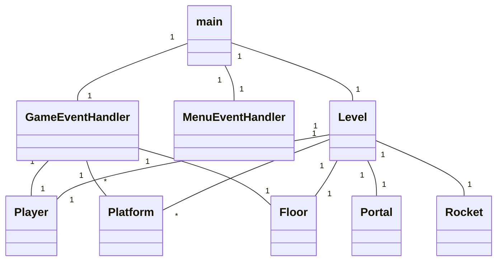
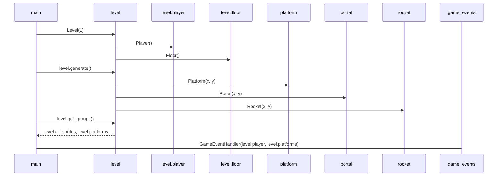

## Luokkakaavio

Sovelluksen tämänhetkinen luokkarakenne:

## Sekvenssikaavio

Sovelluksen käynnistämistä ja pelille välttämättömien luokkien alustamista kuvaava kaavio:

Tämän sekvenssin jälkeen siirrytään pelisilmukkaan, jossa GameEventHandler-luokka valvoo käyttäjän syötteitä, ja välittää Player-luokalle ohjeita liikkumiseen ja hyppimiseen. 
