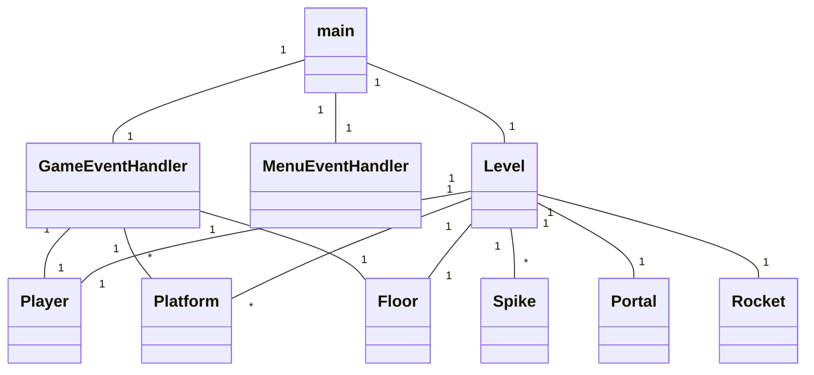
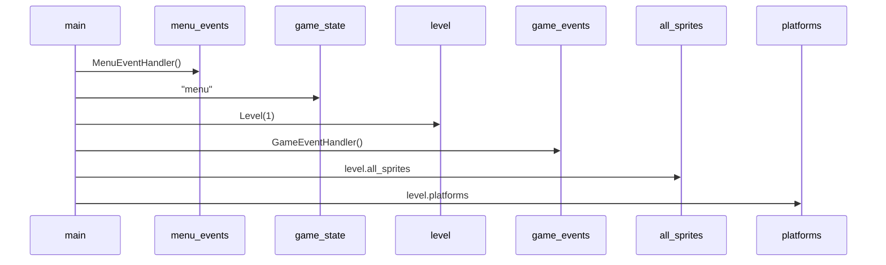
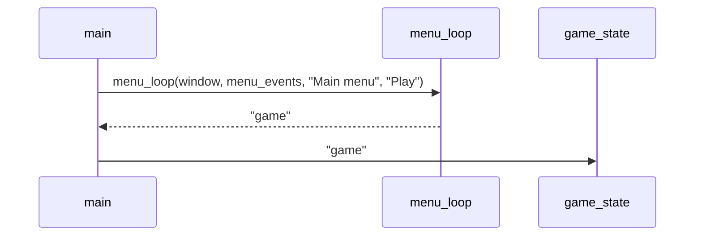
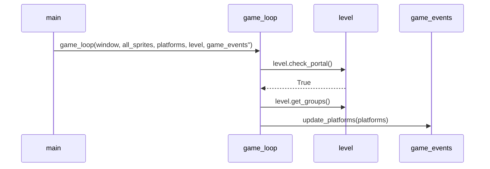

# Arkkitehtuurikuvaus

Projektin hakemistorakenteen ja sovelluslogiikan kuvaus.

## Hakemistorakenne

Projektin lähdekoodi on jaettu useaan moduuliin, jotka on ryhmitelty kansioihin. 

### src/

- **config.py:** Vakiomuuttujat, ikkunan koko, fps, pelaajan kiihtyvyys ja kitka, fontit, tasojen määrä.
- **event_handler.py:** Pelaajan syötteen valvonnasta vastaavat luokat.
- **game.py:** Pelisilmukka, pelin alustusfunktio.
- **level.py:** Tasojen lataaminen ja generointi. Valvoo pelaajan interaktioita portaalien ja piikkien kanssa.
- **main.py:** Pääsilmukka, pelin tilat.
- **text_renderer.py:** Tekstin piirtämisestä vastaavat funtkiot.
- **tasks.py:** Invoke-taskit.
  - Käynnistäminen, testien suorittaminen, pylint, autopep8 ja kattavuusraportin generointi.

### src/assets/

- Pelaajahahmo, platformi, lattia, portaali, raketti ja piikkipallo.
- BMP-muodossa.

### src/levels/

- Json-tiedostoja.
- Sisältävät tasokohtaiset koordinaatit platformeille, portaaleille, piikeille ja raketille.

### src/sprites/

- Pelaaja, platformi, portaali, raketti ja piikki -luokat.

### src/tests/

- Projektin yksikkötestit.
- Jaettu tiedostoihin testattavan alueen mukaan.

### src/ui/

- ui.py
- Pitää sisällään menu-silmukan ja alustusfunktion.

## Sovelluslogiikka

### Keskeisin toiminnallisuus

Projektin sovelluslogiikka on pyritty erottamaan käyttöliittymäkoodista. Logiikka perustuu Level, GameEventHandler ja Player -luokkien yhteistyöhön. GameEventHandler valvoo käyttäjän syötteitä ja kutsuu Player-luokan metodeja niiden mukaan.

Level-luokka valvoo pelaajan siirtymiä portaalien kautta tasolta toiselle ja muodostaa uusia tasoja json-tiedostojen pohjalta. Json-tiedostojen sisältämät arvot eivät muutu pelin aikana. Tiedostot sisältävät sanakirjamaisesti tallennettuja koordinaatteja platformeille, portaaleille, piikeille ja raketille. Level-luokka lukee level_id:n mukaisen json-tiedoston ja muodostaa sen pohjalta ladattavan tason.

Player-luokka pitää sisällään pelaajan liikettä ohjaavat metodit ja suorittaa myös kollisionvalvontaa hyppyjä varten.

Main.py sisältää pelin pääsilmukan, jossa on haara jokaiselle pelin tilalle. Pääsilmukka kutsuu joko ui.py:ssa sijaitsevaa menu_loop-funktiota tai game.py:ssa sijaitsevaa game_loop-funktiota. Kutsuttava loop-funktio palauttaa merkkijonon, jos pelin tilan muuttava tapahtuma tapahtuu. Pelin alussa pääsilmukan game_state muuttuja alustetaan arvolla "menu". Kun pelaaja painaa aloitusnäytön play-nappia, menu_loop palauttaa merkkijonon "game", jonka pääsilmukka tallentaa muuttujaan ja asettaa game_state muuttujan arvoksi, mikä siirtää pääohjelman suorituksen seuraavaan haaraan. 

### Esimerkkejä toiminnallisuudesta

#### Pelaajan liike:

Pelaajan painaessa "a"-näppäintä GameEventHandler kutsuu pelaajaolion change_direction-metodia argumentilla "left", mikä vaihtaa pelaajaolion moveleft-attribuutin arvon True:ksi. Kun "a"-näppäin päästetään irti, GameEventHandler kutsuu samaa change_direction-metodia argumentilla "cancel_left", mikä muuttaa moveleft-attribuutin takaisin False:ksi.

#### Pelaajan siirtyminen seuraavalle tasolle:

Pelaajan törmätessä portaaliin Level-luokka tarkistaa nykyisen tason id-numeron ja aloittaa toimenpiteet, mikäli seuraava taso on olemassa. Jos seuraava taso on olemassa, luokka kutsuu omaa clear_groups- metodia, joka tyhjentää edellisen tason platformit, portaalit ja piikit luokan muistista. Tämän jälkeen kutsutaan generate-metodia, joka pulestaan kutsuu get_level_data-metodia lukeakseen seuraavan tason tiedot json-tiedostosta. Generate-metodi käy läpi sanakirjaa, joka sisältää jokaisen tasolle kuuluvan esineen koordinaatit ja luo vastaavat sprite-oliot. Oliot tallennetaan Level-luokan sprite-ryhmiiin, jotka pelisilmukka lukee ja piirtää näytölle.

## Luokkakaavio

Main-tiedosto tuntee luokat MenuEventHandler, GameEventHandler ja Level. MenuEventHandler valvoo ja hallitsee käyttäjän syötteitä pelin valikkonäkymissä. GameEventHandler valvoo käyttäjän syötteitä varsinaisen pelin sisällä ja kutsuu Player-luokan metodeja pelaajan liikkeen aikaansaamiseksi. Level-luokka pitää sisällään kaiken näytölle piirrettävän ja rakentaa pelin tasot. Level-luokka luo pelaajaolion, joka välitetään myös GameEventHandler-luokalle. 

Level luokka ei kuitenkaan piirrä olioita näytölle, vaan piirtäminen (pygamen blit-metodilla) tapahtuu game_loop-funktiossa. Level-luokan sisältämät näytölle piirrettävät oliot perivät pygamen Sprite-luokan, ja ne on jaettu pygamen sprite groupeihin. Ryhmä all_sprites pitää sisällään kaikki oliot ja ryhmä platforms pitää sisällään oliot, joiden päällä pelaaja voi seistä. Game_loop piirtää jokaisella iteraatiolla kaikki all_sprites-ryhmän sisältämät oliot. 

Jokaisella tasolla voi olla yksi pelaaja, yksi lattia, yksi portaali ja ja yksi raketti. Lisäksi tasolla voi olla monta platformia ja monta piikkipalloa. 

## Sekvenssikaavio

#### Pelin alustaminen ja siirtymä mainin pääsilmukkaan:

Tämän jälkeen suoritus siirtyy silmukkaan, jossa pelin tila muuttuu game_state-muuttujan mukaan. Tässä vaiheessa game_state on "menu". Menu_loop funktio ottaa parametreiksi näytölle piirrettävän tekstin, ikkunan ja MenuEventHandler-olion. Tämän ansiosta samaa funktiota voidaan käyttää pelin kaikissa valikkonäkymissä. 

#### Siirtymäkaavio play-napin painalluksesta:

Tämän jälkeen pääohjelman suoritus siirtyy seuraavaan haaraan, jossa res-muuttujaan tallennetaan nyt game_loop-funktion palautusarvo, joka määräytyy pelaajan toiminnan mukaan. Esimerkiksi jos pelaaja kuolee, palautetaan "death", jos pelaaja pääsee raketille asti, palautetaan "victory". 

#### Seuraavaksi siirtymäkaavio pelaajan etenemisestä seuraavalle tasolle:

Level luokan check_portal-metodin palautettua True, game_loop uudelleenkirjoittaa muuttujat all_sprites (jotka piirretään näytölle) ja platforms (jota player käyttää maassa seisomisen tarkistamiseksi). Lisäksi kutsutaan GameEventHandlerin metodia update_platforms, joka päivittää uuden tason platformien sijainnit. GameEventHandler kutsuu player-luokan hyppymetodia, joka ottaa parametrikseen platforms ryhmän.

Pelin päättyminen pelaajan kuolemaan tai voittoon tapahtuu samankaltaisella logiikalla. Game_loop kutsuu Level-luokan metodeja, jotka palauttavat totuusarvon mikäli ehto täyttyy. Game_loop palauttaa pääohjelmalle vastaavan merkkijonon, jonka mukaan pelin tila muuttuu pääsilmukassa.

### Peliin jääneet heikkoudet / riittämättömyydet

Pelaajan liike ei tällä hetkellä pysähdy siirtyessä tasolta toiselle, mikä saattaa vaikeuttaa pelaamista hieman. Lisäksi piikkien hitboxeilla ei ole tyhjää tilaa, eli törmääminen triggeröityy agressiivisesti ja saattaa myös vaikeuttaa peliä. 
