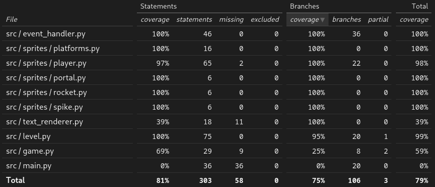

# Testaus

Pelin luokkia on testattu automatisoidusti unittest-kirjastolla. Lisäksi mock-kirjastoa on käytetty suhteellisen paljon, koska moni pelin keskeisistä toiminnallisuuksista riippuu pygame-kirjaston omista moduuleista joiden varsinainen testaaminen menee aivan liian monimutkaiseksi. 

Pelin kokonaiskattavuus on 79% ja haarautumakattavuus 75%.

Kattavuuden ulkopuolelle on jätetty vakiomuuttujia sisältävä config.py ja valikkokäyttöliittymästä vastaava ui/ui.py. 

Pelin main.py:n pääsilmukalle ei saatu aikaiseksi testejä, mikä laskee kokonaiskattavuutta tuntuvasti. Yleisesti pygame-kirjastolla toteutettua peliä on hankala testata, mikä näkyy ehkä kattavuudessa. 

### Asennus ja järjestelmätestaus

Peli on asennettu ja pelattu alusta loppuun seuraavilla käyttöjärjestelmillä:

- Cubbli linux
- Arch linux
- WSL Ubuntu (Windows subsystem for linux, Windows 11)
- Helsingin yliopiston linux-etätyöasema

Kyseisillä käyttöjärjestelmillä on myös suoritettu automatisoidut yksikkötestit ja generoitu kattavuusraportti.
